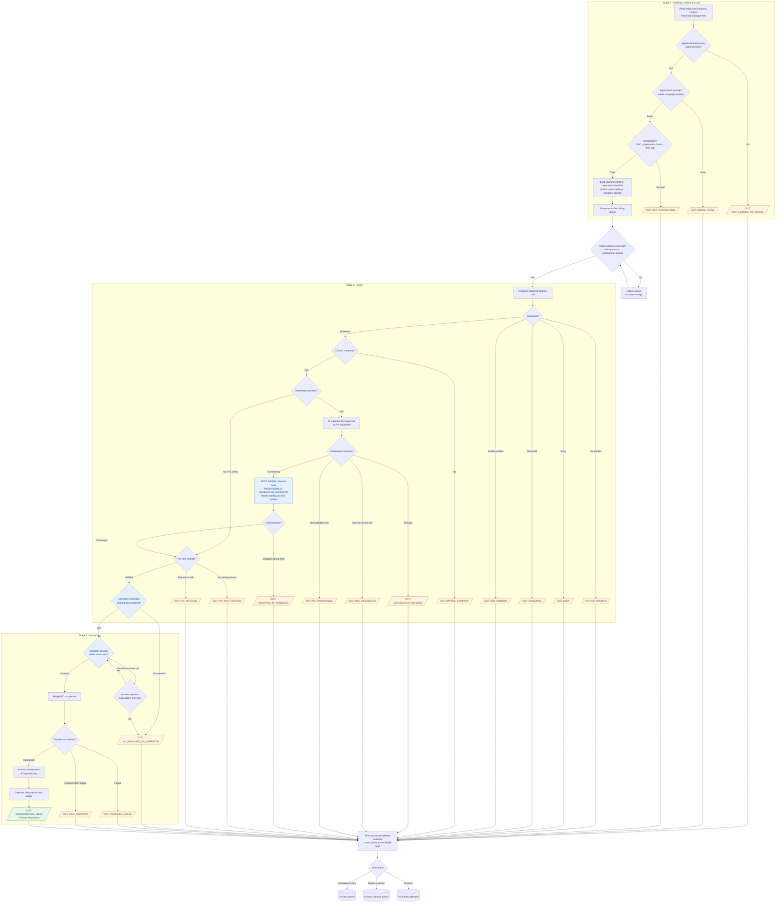
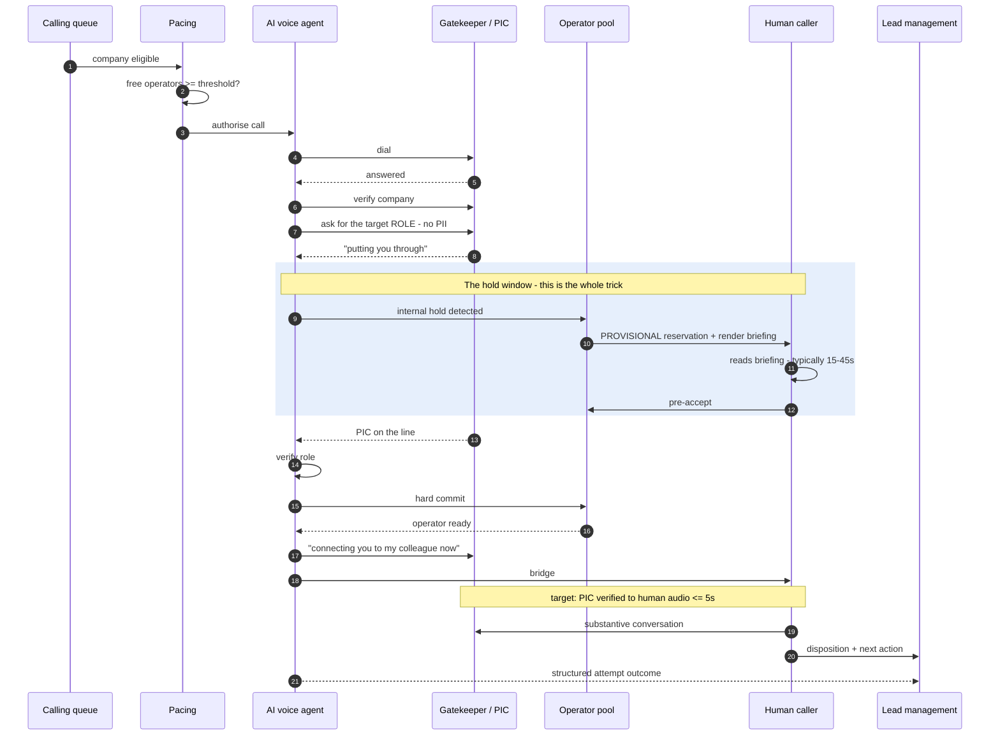
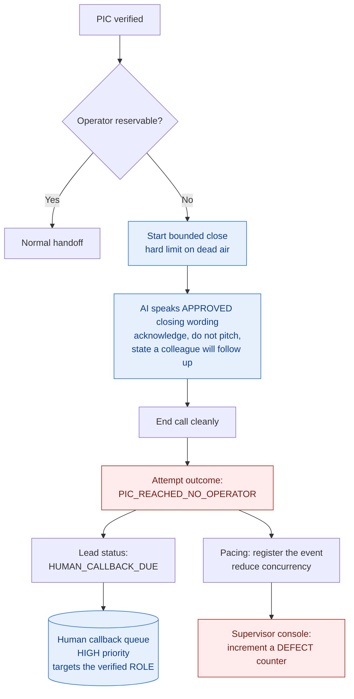
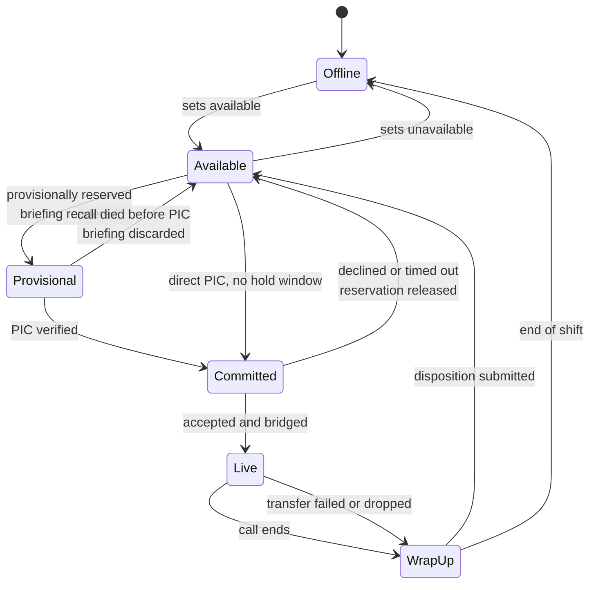

# V2 Workflow — Main Path and Exceptions

Companion to [01-product-refinement.md](01-product-refinement.md). Diagrams are
Mermaid and render in GitHub, GitLab, VS Code and most Markdown viewers.

**The design rule this document exists to enforce:** *every* terminal and
deferred path ends in a defined attempt outcome **and** a lead status in the
system of record. A path that ends without one is a lost lead, and lost leads
are the failure mode that quietly destroys trust in a system like this.

---

## 1. Main path with exceptions

The three blue nodes are the mechanism that distinguishes V2 from a
conventional dialer: **reserve provisionally at the internal hold, gate the
handoff on an explicit accept, and have a defined path when no operator is
available.**

---

## 2. Every exit, its outcome, and what happens to the lead

This is the contract with the system of record. `OUT` values are attempt
outcomes written by V2; lead status and next action are what V2 sets on the lead.

| # | Exit | Attempt outcome | Lead status | Next action | Notes |
| --- | --- | --- | --- | --- | --- |
| X1 | No approved signal | `NOT_ELIGIBLE_NO_SIGNAL` | unchanged | none | Never entered the queue; no attempt recorded |
| X2 | Signal stale | `SIGNAL_STALE` | `AWAITING_SIGNAL_REFRESH` | re-evaluate when a new signal lands | Not a call failure |
| X3 | DNC / suppressed / outside hours / retry cap | `NOT_CONTACTABLE` | `SUPPRESSED` | none while suppression holds | Compliance-owned |
| X4 | No answer | `NO_ANSWER` | `ATTEMPTED` | **AI retry**, backoff, different daypart | Cheapest retry |
| X5 | Busy | `BUSY` | `ATTEMPTED` | **AI retry**, short backoff | Busy implies someone is there |
| X6 | Voicemail | `VOICEMAIL` | `ATTEMPTED` | **AI retry**, different daypart; no message left in V2 | Leaving messages is out of scope |
| X7 | Invalid / unobtainable number | `BAD_NUMBER` | `DATA_QUALITY_ISSUE` | **human** data fix; no AI retry | Retrying a bad number wastes capacity forever |
| X8 | Wrong company answered | `WRONG_COMPANY` | `DATA_QUALITY_ISSUE` | **human** data fix; no AI retry | Same reasoning |
| X9 | Gatekeeper refused | `GATEKEEPER_REFUSED` | `ATTEMPTED` | **AI retry**, capped attempts, try a different daypart | Cap tightly - repeat refusals damage the brand |
| X10 | Do-not-call requested | `DNC_REQUESTED` | `DO_NOT_CALL` | **none, permanently** | **Immediate, irreversible by the system.** Compliance-critical |
| X11 | PIC not available now | `PIC_UNAVAILABLE` | `ATTEMPTED` | **AI retry**, honour any stated better time | Capture the time window, never a name |
| X12 | Dropped during internal hold | `DROPPED_IN_TRANSFER` | `ATTEMPTED` | **AI retry**, short backoff | Likely the company's PBX, not ours |
| X13 | Reached a person, role not verified | `PIC_NOT_VERIFIED` | `ATTEMPTED` | **AI retry** with refined role wording | Also a signal that targeting is wrong |
| X14 | PIC refused to talk | `PIC_REFUSED` | `NURTURE` | no AI retry this campaign | A verified rejection is real information |
| **X15** | **PIC reached, no operator available** | **`PIC_REACHED_NO_OPERATOR`** | **`HUMAN_CALLBACK_DUE`** | **human callback queue, priority high, targets the verified ROLE** | **Never the AI retry queue.** See §4 |
| X16 | Transfer failed after accept | `TRANSFER_FAILED` | `HUMAN_CALLBACK_DUE` | **human callback**, priority high | Our fault; the PIC was ready |
| X17 | Call dropped after bridge | `CALL_DROPPED` | `HUMAN_CALLBACK_DUE` | **human callback**, priority high | Operator has partial context already |
| D8 | Conversation held | `CONVERSATION_HELD` | set by the operator's disposition | per disposition | The only success path |

### Which status changes need human confirmation

Not all of these should be machine-settable. Recommended split:

| Machine may set directly | Requires human confirmation |
| --- | --- |
| `ATTEMPTED`, `AWAITING_SIGNAL_REFRESH`, `DATA_QUALITY_ISSUE`, `HUMAN_CALLBACK_DUE` | Anything that **ends** pursuit or changes commercial meaning: `NURTURE`, `DISQUALIFIED`, opportunity creation, or any stage advance |
| `DO_NOT_CALL` — **machine-set immediately**, because a compliance obligation must not wait for a human | Reversing `DO_NOT_CALL` — compliance owner only |

The principle: **V2 may record what happened; only a human may decide what a
lead now means commercially.** The single exception is DNC, where the safe
default runs the other way.

---

## 3. The reservation ladder over time

This is the timing that makes requirement 8 — "must not leave the PIC waiting" —
achievable rather than aspirational.

**If the hold is short or absent** — the PIC picks up immediately — there is no
reading window. The operator then receives the briefing and the accept prompt
simultaneously, and the latency budget is tighter. This case must be measured
separately in E2; it is the worst case for requirement 8 and the most likely
source of poor operator experience.

---

## 4. The no-operator path, in detail

Required acceptance scenario 2. Deliberately drawn on its own because it is the
path most likely to be implemented badly.

Four properties that matter:

1. **Bounded.** The close begins on a timer, not on hope. Recommended: dead air
   never exceeds ~8 seconds; the call is closed within ~20 seconds of PIC
   verification.
2. **Approved wording.** Compliance-owned, versioned, and auditable — not
   model-improvised.
3. **A different queue.** `HUMAN_CALLBACK_DUE` goes to a **human** callback
   queue. It must never re-enter the AI retry queue: this person has already
   been reached and spoken to, and calling them again with a machine would be
   worse than not calling.
4. **Counted as a defect.** A rising rate here means pacing is too aggressive.
   It appears on the supervisor console next to abandonment, not buried in a
   report.

**What is retained:** the verified *role* ("Head of General Insurance") and the
company. **What is not:** any name, direct number, or other identifier the
gatekeeper may have said aloud — P-01 §4.5.

---

## 5. Operator states

Invariants the implementation must guarantee:

- An operator is `Live` on **at most one** call — requirement 9.
- `WrapUp` **must** complete before returning to `Available`; disposition is not
  optional, because an un-dispositioned call is a lost outcome.
- `Provisional` is always time-bounded and always releases — a stuck provisional
  reservation silently removes an operator from the pool, which is the kind of
  bug that looks like "we need more staff".
- Only `Available` operators are counted by pacing. `Provisional` counts as
  committed capacity, not spare.

---

## 6. Where each concept lives

Restating the P-01 §4.1 distinction against the diagrams above, because conflating
these is what produces lost leads:

| Concept | Appears above as | Owned by |
| --- | --- | --- |
| Lead status | the `W1` write-back and the §2 table | Lead management — system of record |
| Scheduled retry | `W3` AI retry queue | V2 scheduler |
| Work queue | the calling queue, `W4` human callback queue | V2 |
| Human assignment | `Provisional` / `Committed` in §5 | V2 operator pool |
| Live-call routing | the bridge step in §3 | Asterisk |
